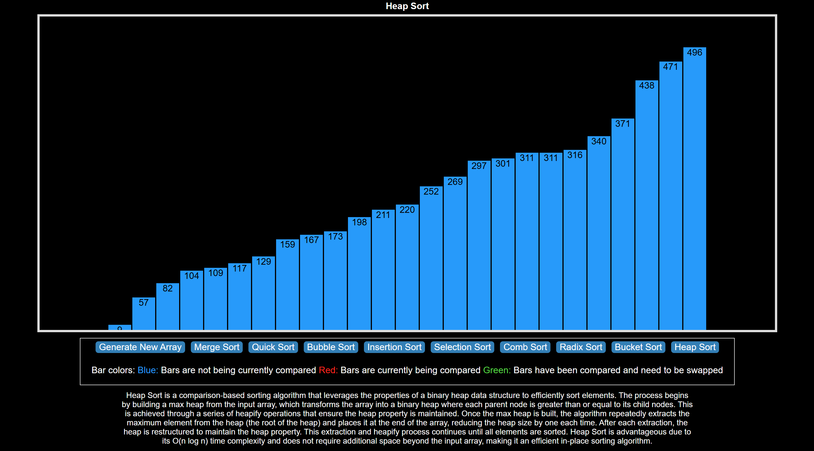

# Overview
This project is a React-based visualizer for various sorting algorithms. It helps in understanding how different sorting algorithms work by displaying animations of the sorting process in real-time.

# Features
- Visual Representation: Watch sorting algorithms in action with animated bars.
- Multiple Algorithms: Supports a variety of popular sorting algorithms.
- Real-Time Descriptions: Get descriptions of each algorithm as you visualize them.
- Dynamic Array Generation: Generate a new array at any time to see how different algorithms handle it.
- Responsive Design: Adapts to different screen sizes for a seamless experience.

# Technologies Used
- React: JavaScript library for building user interfaces.
- CSS: For styling the application.

# Installation
Clone the Repository
```bash
https://github.com/carlos-22-chasi/Sorting-Algorithm-Visualizer.git
cd Sorting-Algorithm-Visualizer
```
Install Dependencies Make sure you have Node.js installed, then run:
```bash
npm install
```
Start the Application
```bash
npm start
```
The application will open in your default browser at http://localhost:3000.



# Usage
- Generate New Array: Click on the "Generate New Array" button to create a new random array.
- Select an Algorithm: Click on any of the sorting algorithm buttons to visualize the sorting process.
- Bar Colors:
Blue: Bars are not being currently compared.
Red: Bars are currently being compared.
Green: Bars have been compared and need to be swapped.

# Sorting Algorithms
This visualizer supports the following algorithms:
- Merge Sort
- Quick Sort
- Bubble Sort
- Insertion Sort
- Selection Sort
- Comb Sort
- Radix Sort
- Bucket Sort
- Heap Sort
  
Each algorithm comes with an animation to illustrate how it works and a brief description that appears during the visualization.

# Customization
You can easily customize the visualizer by changing the following constants in SortingVisualizer.js:

- Animation Speed: Modify ANIMATION_SPEED_MS to increase or decrease the speed of the animations.
- Number of Bars: Adjust NUMBER_OF_ARRAY_BARS to change how many bars are displayed.
- Bar Colors: Customize the bar colors using PRIMARY_COLOR, SECONDARY_COLOR, and THIRD_COLOR.
